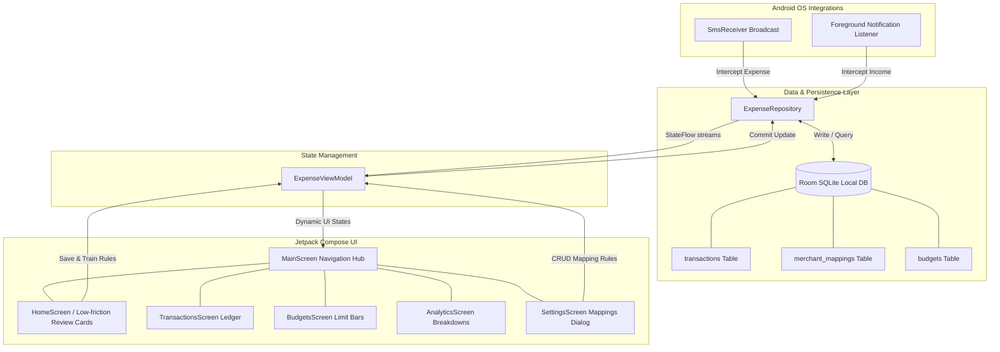

# PayStory

<p align="center">
  
</p>

<p align="center">
  <strong>Every payment has a story. Your app helps users remember it.</strong>
</p>

<p align="center">
  <a href="https://kotlinlang.org/"></a>
  <a href="https://developer.android.com/jetpack/compose"></a>
  <a href="https://developer.android.com/studio"></a>
  <a href="LICENSE"></a>
  
  
</p>

---

## Overview

### The Problem
Most personal finance apps suffer from a fundamental problem: **friction**. Traditional budget tools require you to manually open the app and type in the vendor, the amount, the category, and the details of every purchase you make. Because life moves quickly, users fall behind, forget their transactions, and eventually abandon manual trackers.

### Why Existing Trackers Fail
* **Manual Overload**: Entering 10 transactions a day manually leads to cognitive fatigue.
* **Lack of Context**: Looking at a bank ledger list that reads `"SWIGGY_PAYMENT_9921_DELHI"` two weeks later tells you *what* you spent, but it doesn't capture the *why* (e.g., *"Bought dinner for the team after launch"*).
* **Privacy Vulnerability**: Many automated trackers sync your private credentials, scrape your emails, or send raw transactional data to third-party cloud servers.

### The PayStory Solution
**PayStory** automates expense logging with **zero manual data input and complete on-device privacy**. By acting as a secure system-level listener, the application intercepts push notifications from major payment/wallet apps and incoming bank transactional SMS messages. 

When a transaction is detected, the app automatically extracts the amount, vendor, and bank, predicts the category, and prompts you with a low-friction **"PayStory card"** to review. With one tap, you can save, edit, or append the real human story behind the transaction—keeping your financial ledger complete, accurate, and 100% private.

---

## Key Features

### :white_check_mark: Implemented (v1.0.0)
* **Dual Interception Engines**: SMS Interception (`SmsReceiver`) and Push Notification interception (`TransactionNotificationListener` foreground service) supporting major UPI payment apps.
* **Auto-Pilot Smart Classifier**: Continuous on-device learning engine matching merchant tags to 11 standard financial categories.
* **Low-Friction Review Flow**: The **"NEW PAYSTORY" Dashboard Prompt** and modal sheets that display matching confidence ratings (`HIGH`, `MEDIUM`, `LOW`) and auto-suggest story descriptions for quick confirmation.
* **Local Mappings Manager**: A fully-featured rule editor in the settings screen supporting CRUD operations to train and customize classification rules.
* **Date-Grouped Search Ledger**: Fully searchable history log filtered by category chips or keywords.
* **Intelligent Budgets & Alerts**: Category limit bars that shift colors based on spend ratio, accompanied by logs tracking system-generated **Budget Alerts** at 80% and 100% thresholds.
* **Visual Analytics**: Interactive breakdowns showcasing spend shares and category metrics.
* **Local Identity Vault**: Fully offline account registration and secure local session management.

### :hourglass_flowing_sand: In Progress
* **Dynamic Search Aggregators**: Multi-select transaction bulk actions.
* **Export Ledger Reports**: Local CSV and JSON ledger exports for custom sheets modeling.

### :crystal_ball: Planned (Roadmap)
* **Gemini AI Summaries**: Deep context summarizers using local Gemini Nano integration.
* **Voice Transaction Logging**: Hands-free spoken transaction entries parsed with on-device NLP.

---

## Application Architecture

PayStory follows **Clean Architecture** patterns separated into distinct MVVM layers:



---

## Tech Stack

* **Frontend Framework**: Jetpack Compose (Kotlin)
* **Design System**: Material Design 3 (M3)
* **Local Database**: Room Persistence Library (SQLite)
* **Concurrency**: Kotlin Coroutines & Flows
* **Network & Parsing**: Regular Expressions (Regex), Moshi JSON Converters
* **Testing Engines**: Robolectric (JVM Android Simulation), Roborazzi (Visual Regression & Screenshot Verification)
* **Secrets Handling**: Maps Platform Secrets Gradle Plugin

---

## Folder Structure

The folder layout mirrors our clean separation of concerns:

```text
/
├── app/
│   ├── src/
│   │   ├── main/
│   │   │   ├── java/com/example/
│   │   │   │   ├── ExpenseApplication.kt     # App entry class initializing database & repository
│   │   │   │   ├── MainActivity.kt           # Host activity setting up theme & Compose Navigation
│   │   │   │   ├── data/                     # Relational local database files
│   │   │   │   │   ├── local/                # AppDatabase and Dao definition files
│   │   │   │   │   ├── models/               # Room SQLite entities & Category Enums
│   │   │   │   │   └── repository/           # ExpenseRepository orchestration class
│   │   │   │   ├── services/                 # Low-level system-to-app receiver services
│   │   │   │   │   ├── SmsReceiver.kt        # Intercepts transactional debit messages
│   │   │   │   │   ├── TransactionNotificationListener.kt # Intercepts UPI notifications in foreground
│   │   │   │   │   └── NotificationHelper.kt # Local post notifications dispatcher
│   │   │   │   └── ui/                       # Material 3 screens & views
│   │   │   │       ├── screens/              # Individual Jetpack Compose Screens
│   │   │   │       ├── theme/                # Custom App Typography & Colors (Slate Theme)
│   │   │   │       └── viewmodel/            # ExpenseViewModel business logic & StateFlows
│   │   │   └── res/                          # Android Resources (strings.xml, layout bounds)
│   │   └── test/                             # Local JVM tests suite (Robolectric & Roborazzi)
│   └── build.gradle.kts                      # Module-level compilation build dependencies
├── gradle/                                   # Gradle wrappers and Dependency Version Catalog
│   └── libs.versions.toml                    # Centrally managed library coordinates
├── .env.example                              # Template environment variables
├── .gitignore                                # Optimized git exclude list
├── metadata.json                             # Platform Metadata syncing rules
├── LICENSE                                   # MIT open-source license terms
└── README.md                                 # Executive repo guidebook
```

---

## Screenshots

<p align="center">
  
  
  
  
</p>

*(Placeholders: Add real screen assets under `/assets/` directory during delivery)*

---

## Installation & Setup

### 1. Prerequisites
* **JDK 17** or higher.
* **Android Studio Ladybug (2024.2.1)** or higher.
* Android SDK 36.

### 2. Setup Variables
Clone the code, copy the variables template, and open the folder inside Android Studio:
```bash
git clone https://github.com/YOUR_ACCOUNT/PayStory.git
cd PayStory
cp .env.example .env
```

### 3. Execution
Connect your Android phone (or open an Emulator) and run the `app` configuration.

---

## Firebase Setup (Planned Future Integration)

To support secure cross-device synchronization in the future, PayStory is prepared for Firebase integrations. The current core is **100% offline-first**. 

When cloud features are enabled, the following configuration is used:

### Planned Collections
1. **`users` Collection**: Stores user profile structures.
2. **`transactions` Collection**: Backs up reviewed payment records with `userId` security boundaries.
3. **`merchant_mappings` Collection**: Synchronizes trained categorization rules across device clusters.

### Security Rules Configuration
```javascript
rules_version = '2';
service cloud.firestore {
  match /databases/{database}/documents {
    match /users/{userId} {
      allow read, write: if request.auth != null && request.auth.uid == userId;
    }
    match /transactions/{txId} {
      allow read, write: if request.auth != null && resource.data.userId == request.auth.uid;
    }
    match /merchant_mappings/{mappingId} {
      allow read, write: if request.auth != null;
    }
  }
}
```

---

## Permissions Overview

For detailed explanation, refer to [Permissions Guide](docs/permissions.md).

* **`android.permission.RECEIVE_SMS`**: Listens for incoming payment text alerts.
* **`android.permission.READ_SMS`**: Parses SMS alphanumeric strings to extract currency data.
* **`android.permission.POST_NOTIFICATIONS`**: Alerts the user on transactions and budget overruns.
* **`android.permission.FOREGROUND_SERVICE`**: Standard permission ensuring persistent background service monitoring.
* **`android.permission.REQUEST_IGNORE_BATTERY_OPTIMIZATIONS`**: Whitelists PayStory from OS-level task-killers.

---

## How It Works

1. **Expense Interception**: An incoming debit SMS (e.g., `"Spent Rs. 450 via HDFC..."`) is intercepted by `SmsReceiver`. It parses the message and extracts the currency, bank sender, and reference code.
2. **Income Interception**: Push alerts from UPI apps are read by the `TransactionNotificationListener` service.
3. **Story Suggestion**: When a transaction is saved to the local database, it sets `isReviewed = false`. The app uses continuous local learning (`merchant_mappings` table) or built-in rules to predict the merchant's category and suggest a descriptive story.
4. **Instant Review**: The user sees a high-priority **"NEW PAYSTORY" Card** on the HomeScreen. With one tap, they can save the suggested mapping or refine the story description.
5. **Continuous Learning**: Saving edits updates the database's rule mappings, allowing the app to auto-pilot future occurrences of the same merchant with high confidence.

---

## Future Feature Roadmap

* **AI-Pilot Categorization**: Native Google Gemini models to automate categorizations.
* **Voice-Guided Ledger Logging**: Record complex transactions hands-free with spoken phrases.
* **Subscription & Recurrent Bill Detection**: Automated scanning of dates and values to flag upcoming billing renewals.
* **Monthly Financial Coaching summaries**: Dynamic monthly expenditure summary audits compiled locally.

---

## Contributing

Refer to our comprehensive [Contributing Guide](CONTRIBUTING.md) to explore the visual styling rules, git workflows, coding standards, and PR submissions.

---

## Security & Privacy Commitment

Refer to our [Security Policy](SECURITY.md) to explore detailed privacy protections. PayStory will **never** ask for your bank logins, online account credentials, credit card details, or open banking APIs. All financial records are processed **strictly on your physical device**.

---

## FAQ

#### Q: Does PayStory run in the background?
Yes, it uses a lightweight system notification listener and broadcast receiver. On Android 9+, it promoted itself to a foreground service to guarantee continuous operation without draining the battery.

#### Q: How does PayStory work offline?
It is fully offline-first. It relies on local regular expressions to parse incoming text messages and status notification alerts. All transaction histories are stored on-device in a Room SQLite database.

---

## Known Limitations

* **App Notification Restrictions**: To capture app notifications, the system requires active user consent. You must toggle this permission manually under Android system settings.
* **Text Formatting**: Very unusual SMS strings might occasionally slip past our regex engine. Users can easily add or log missed items manually inside the app.

---

## Credits & Attribution

* Developed and designed by **PayStory Authors**.
* Driven by [Jetpack Compose](https://developer.android.com/jetpack/compose) and [Room SQLite Database](https://developer.android.com/training/data-storage/room).

---

## License

PayStory is distributed as an open-source product under the terms of the [MIT License](LICENSE).
