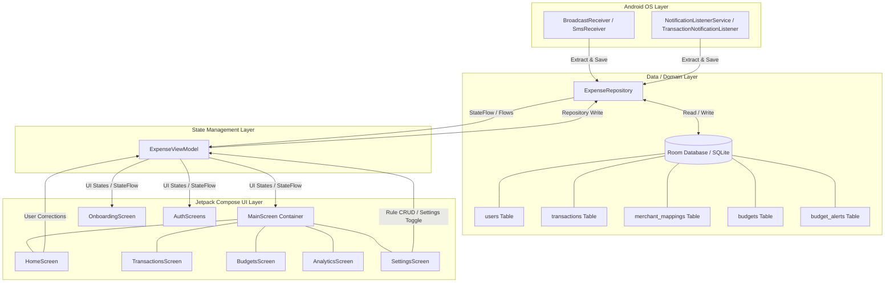
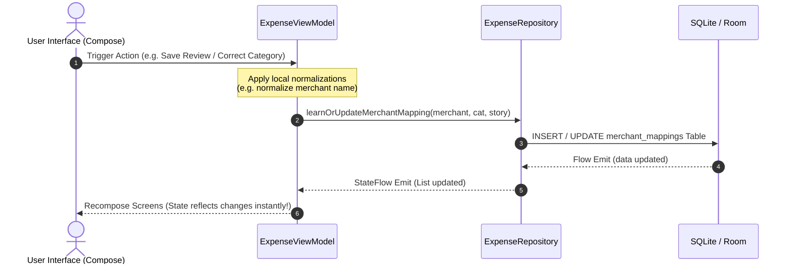

# System Architecture

This document describes the high-level system architecture of **PayStory**, an offline-first Android application designed to detect, process, and record transactions securely on-device.

---

## High-Level Architecture Overview

PayStory is built following **Clean Architecture** principles combined with **MVVM (Model-View-ViewModel)** to guarantee separation of concerns, testability, and robustness. 

All core user data is stored locally using **Room Database (SQLite)**. Background processes receive events from the Android OS and update the repository, triggering reactive StateFlow streams that propagate instantly to the Jetpack Compose UI.

---

## Architectural Layers

### 1. Presentation (UI) Layer
* **Jetpack Compose Screens**: Declarative, Material 3 styled layouts that recompose dynamically based on state changes.
* **Single Activity Architecture**: `MainActivity` is the single entry point. Routing is managed type-safely via Compose Navigation (`androidx.navigation`).
* **Interactive Modals & Banners**: Banners (e.g., "NEW PAYSTORY" card) on `HomeScreen` or `ModalBottomSheet` on `MainScreen` pop up immediately when unreviewed transactions are recorded.

### 2. State Management Layer (`ExpenseViewModel`)
* **`StateFlow` & `SharingStarted`**: Exposes hot flows of lists (`transactions`, `merchantMappings`, `budgets`) to the UI. It transforms cold Database Flows into UI-ready flows using `stateIn`.
* **Smart Classifier Engine**: Handles merchant classification, confidence scoring (`HIGH`, `MEDIUM`, `LOW`), and continuous rule adjustments on-the-fly.

### 3. Data / Domain Layer (`ExpenseRepository`)
* **Unified Single Source of Truth**: `ExpenseRepository` orchestrates read/write requests, transaction reviews, and rule mappings.
* **Transaction Deduplication Logic**: Employs rigorous checks comparing recent timestamps (30s) and reference numbers to discard duplicate events.

### 4. Background Services Layer
* **Passive SMS Pipeline (`SmsReceiver`)**: Reacts to incoming bank debit text messages.
* **Active Foreground Listener (`TransactionNotificationListener`)**: Continuous notification observer promoted to an Android Foreground Service to avoid memory termination.

---

## State Management Flow

PayStory uses a reactive unidirectional data flow. The UI never writes directly to the Database, and the database never pushes raw models straight to screens.

