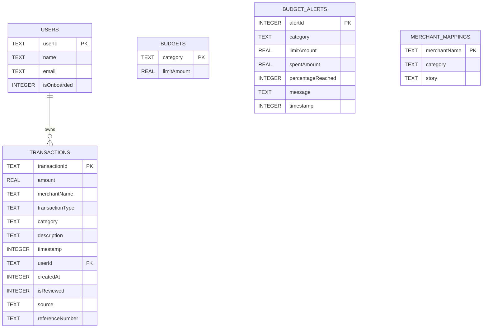

# Database Schema (SQLite / Room)

This document provides a breakdown of **PayStory's** relational database structure. The database is stored fully offline and is managed using the Android **Room Persistence Library** with SQLite.

---

## Database Configuration

* **Database Class**: `com.example.data.local.AppDatabase`
* **Version**: `2` (Pre-existing v1 migrates seamlessly to v2 to add the `merchant_mappings` table).
* **Export Schema**: Disabled for development agility.

---

## Entity Relationship Model

---

## Table Schemas

### 1. `users` Table
Stores basic profile info for the local authenticated account.

| Field | SQLite Type | Room Variable Type | Nullable | Description |
|---|---|---|---|---|
| `userId` | `TEXT` | `String` | No | **Primary Key**. Unique identifier of the user (e.g. email or UUID). |
| `name` | `TEXT` | `String` | No | Display name of the user. |
| `email` | `TEXT` | `String` | No | User's registered email address. |
| `isOnboarded` | `INTEGER` | `Boolean` | No | Flag indicating if onboarding wizard is completed. (0 = false, 1 = true). |

### 2. `transactions` Table
Stores all auto-detected or manually reviewed transaction records.

| Field | SQLite Type | Room Variable Type | Nullable | Description |
|---|---|---|---|---|
| `transactionId` | `TEXT` | `String` | No | **Primary Key**. UUID representation. |
| `amount` | `REAL` | `Double` | No | Monetary value of the transaction. |
| `merchantName` | `TEXT` | `String` | No | Raw or parsed name of payee or payor. |
| `transactionType` | `TEXT` | `String` | No | Either `"SENT"` (Expense) or `"RECEIVED"` (Income). |
| `category` | `TEXT` | `String` | No | String key of the `Category` enum. |
| `description` | `TEXT` | `String` | No | Human context/story notes for this transaction. |
| `timestamp` | `INTEGER` | `Long` | No | Unix epoch millisecond timestamp of transaction occurrence. |
| `userId` | `TEXT` | `String` | No | Foreign Key pointing to `users.userId`. |
| `createdAt` | `INTEGER` | `Long` | No | Timestamp of database insertion. |
| `isReviewed` | `INTEGER` | `Boolean` | No | Flag indicating if user reviewed and approved/saved context. |
| `source` | `TEXT` | `String` | No | Detection source: `"sms"`, `"notification"`, or `"manual"`. |
| `referenceNumber` | `TEXT` | `String` | Yes | System-parsed bank reference / UTR ID. Used for deduplication. |

### 3. `budgets` Table
Defines limit caps for specific transaction categories.

| Field | SQLite Type | Room Variable Type | Nullable | Description |
|---|---|---|---|---|
| `category` | `TEXT` | `String` | No | **Primary Key**. Enum value of category (e.g., `"FOOD"`, `"TRAVEL"`). |
| `limitAmount` | `REAL` | `Double` | No | Maximum threshold amount allocated for the month. |

### 4. `budget_alerts` Table
Records automated limit notifications triggered by background/foreground transactions.

| Field | SQLite Type | Room Variable Type | Nullable | Description |
|---|---|---|---|---|
| `alertId` | `INTEGER` | `Int` | No | **Primary Key** (Auto-incremented). |
| `category` | `TEXT` | `String` | No | Cap category. |
| `limitAmount` | `REAL` | `Double` | No | Limit cap threshold value. |
| `spentAmount` | `REAL` | `Double` | No | Current calculated expenditure. |
| `percentageReached` | `INTEGER` | `Int` | No | Usually `80` or `100`. |
| `message` | `TEXT` | `String` | No | Human alert text displayed to users. |
| `timestamp` | `INTEGER` | `Long` | No | Timestamp of alert trigger. |

### 5. `merchant_mappings` Table
The local continuous learning database. Stores corrected classifications.

| Field | SQLite Type | Room Variable Type | Nullable | Description |
|---|---|---|---|---|
| `merchantName` | `TEXT` | `String` | No | **Primary Key**. Lowercase, alphanumeric normalized merchant title. |
| `category` | `TEXT` | `String` | No | Trained Category enum name. |
| `story` | `TEXT` | `String` | No | Trained dynamic contextual story text. |
