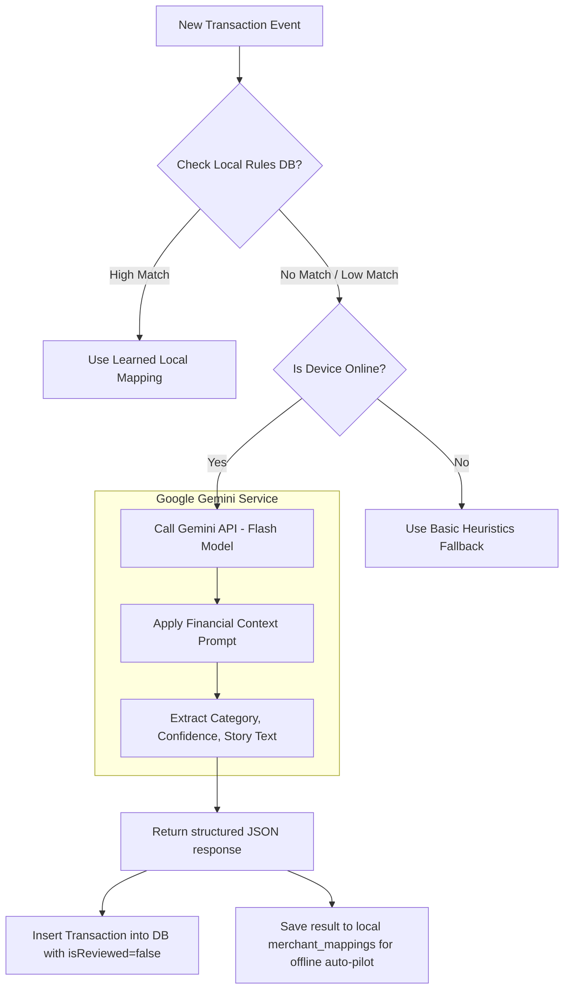

# Future AI Integration Design (Google Gemini)

This document provides a technical design framework for future iterations of **PayStory** utilizing **Google Gemini AI** models. It covers model selection, architectural integrations, prompt structures, and offline-first fallback strategies.

---

## AI Architecture Design

When Gemini AI capabilities are enabled, the local rule classifier works alongside a server-side or SDK-based Gemini instance. Local classification remains the immediate fallback to ensure offline usability and privacy.



---

## Model Recommendations

For an on-device personal finance application, **speed, privacy, and low latency** are critical. We recommend the following tiered model strategy:

| Tier | Recommended Model | Use Case | Benefits |
|---|---|---|---|
| **Primary** | `gemini-1.5-flash` / `gemini-2.5-flash` | Real-time classification, transaction story creation, voice note parsing. | Sub-second latency, lightweight token processing, low cost. |
| **Secondary** | `gemini-1.5-pro` / `gemini-2.5-pro` | Monthly financial audit logs, deep spending trends, dynamic advisory summaries. | Massive context window, deep reasoning capabilities. |
| **Device-Local** | `Gemini Nano` (via AICore) | On-device private text/SMS classification and story translation. | Runs fully offline, zero-network overhead, 100% private. |

---

## Prompt Engineering Configurations

### 1. Real-Time Transaction Categorization
When a transaction is parsed but has no local mapping, the following JSON-structured prompt can be sent to Gemini Flash:

```text
System Prompt:
You are a highly specialized financial assistant. Your task is to analyze raw credit/debit transaction messages and extract structured metadata.

Categories available: [FOOD, GROCERY, SHOPPING, TRAVEL, FUEL, BILLS, RENT, EDUCATION, HEALTH, ENTERTAINMENT, OTHERS]

Respond ONLY with a valid, single JSON object containing:
1. "category": String (must be one of the categories above)
2. "confidence": String ("HIGH", "MEDIUM", "LOW")
3. "story": String (a short, 5-8 word human explanation, e.g. "Ordered lunch delivery", "Refueled the car", "Weekly grocery replenishment")

Input Transaction Message:
"Debited Rs. 450 at SWIGGY FOOD DELHI. Ref: 41258963"

Output:
{
  "category": "FOOD",
  "confidence": "HIGH",
  "story": "Ordered lunch delivery via Swiggy"
}
```

### 2. Voice-to-Story Transaction Parser
For users who record hands-free transaction logs (e.g. speaking "Spent 1200 rupees on dinner with friends at Joe's Pizza"):

```text
System Prompt:
Convert raw spoken financial statements into a structured transaction log.

Input Spoken Text:
"Just spent twelve hundred rupees on dinner with friends at Joe's Pizza"

Output JSON:
{
  "amount": 1200.00,
  "merchant": "Joe's Pizza",
  "transactionType": "SENT",
  "category": "FOOD",
  "story": "Dinner with friends at Joe's Pizza"
}
```

### 3. Monthly Financial Summary & Advisory
To generate personalized financial coaching reports at the end of the month:

```text
Input Context (List of Transactions & Budgets):
- FOOD budget: ₹10,000, Spent: ₹12,500 (Exceeded!)
- TRAVEL budget: ₹5,000, Spent: ₹2,100
- Top Merchants: SWIGGY (7 purchases), SHELL PETROL (1 purchase), HDFC CREDIT CARD BILL (1 purchase)

Prompt:
Analyze the spending records above. Provide a friendly, motivational financial summary of the month. Outline:
1. One major positive spending pattern.
2. One specific area of concern (referencing categories that exceeded limits).
3. Two actionable, realistic tips for next month.
Keep the tone encouraging, clear, and professional. Avoid generic financial jargon.
```

---

## Offline-First Fallback Strategy

To preserve privacy and allow core offline functionality, the AI system operates as a hybrid engine:

1. **Local Rules First**: The application checks the local `merchant_mappings` table. If there is a matching rule, it uses it immediately (eliminating network delay and API costs).
2. **Immediate Heuristics Fallback**: If the device is offline, a local pattern matcher categorizes the transaction (e.g., matching `"swiggy"` to `Category.FOOD`).
3. **Queue-and-Process**: When network access is restored, the application can optionally batch-process unreviewed, uncategorized transactions to fetch high-quality category and story recommendations from Gemini.
