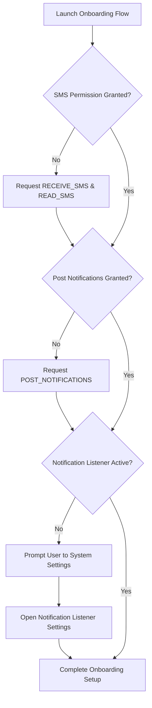

# Android System Permissions

To capture payment messages and status bar alerts in real-time, **PayStory** requires several system-level permissions. This document describes each permission, why it is necessary, how it is requested, and how to verify its state.

---

## Declared Permissions

The following permissions are registered in the application's `AndroidManifest.xml` file:

```xml
<uses-permission android:name="android.permission.POST_NOTIFICATIONS" />
<uses-permission android:name="android.permission.RECEIVE_SMS" />
<uses-permission android:name="android.permission.READ_SMS" />
<uses-permission android:name="android.permission.FOREGROUND_SERVICE" />
<uses-permission android:name="android.permission.FOREGROUND_SERVICE_SPECIAL_USE" />
<uses-permission android:name="android.permission.REQUEST_IGNORE_BATTERY_OPTIMIZATIONS" />
```

---

## Detailed Explanation of Permissions

### 1. `POST_NOTIFICATIONS`
* **API Level**: Android 13 (API 33) and above.
* **Type**: Dangerous (Runtime request).
* **Why it's needed**:
  * Displays real-time transaction alerts and context-review reminders.
  * Displays critical high-threshold budget alerts (e.g., spending has hit 80% or 100% of limits).
  * Runs the required persistent foreground notification for background services.

### 2. `RECEIVE_SMS` & `READ_SMS`
* **API Level**: All levels.
* **Type**: Dangerous (Runtime request).
* **Why it's needed**:
  * **`RECEIVE_SMS`**: Directs the operating system to wake up our `SmsReceiver` whenever a text is received on the device.
  * **`READ_SMS`**: Grants read permissions to the incoming SMS string representation so the regex engines can extract currency numbers, banks, and transaction references.

### 3. `FOREGROUND_SERVICE` & `FOREGROUND_SERVICE_SPECIAL_USE`
* **API Level**: Android 9 (API 28) and Android 14 (API 34) respectively.
* **Type**: Normal / Signature permissions.
* **Why it's needed**:
  * Promotes the `TransactionNotificationListener` service to a system-registered foreground service accompanied by an active status bar notification icon.
  * Prevents Android's low-memory killer (LMK) from shutting down listener routines during background sleep states.
  * Under Android 14+, registered under type `specialUse` with the metadata subtype: `"Track financial transaction alerts offline"`.

### 4. `REQUEST_IGNORE_BATTERY_OPTIMIZATIONS`
* **API Level**: Android 6.0 (API 23) and above.
* **Type**: Special Access.
* **Why it's needed**:
  * White-lists PayStory from aggressive Doze modes and App Standby buckets, ensuring immediate SMS broadcast delivery.

---

## Runtime Permission Flows

PayStory prompts permissions gracefully using Compose runtime adapters:



### System Redirect Actions
Since third-party applications are **strictly prohibited** from programmatically granting themselves the right to read other application notifications, the user must activate this manually:

* **Intent Action**: `Settings.ACTION_NOTIFICATION_LISTENER_SETTINGS`
* **Code Implementation** (`SettingsScreen.kt`):
  ```kotlin
  val intent = Intent("android.settings.ACTION_NOTIFICATION_LISTENER_SETTINGS")
  context.startActivity(intent)
  ```
  This redirects the user to the native OS Settings screen where they can toggle the switch to grant PayStory permission to intercept notification broadcasts.
