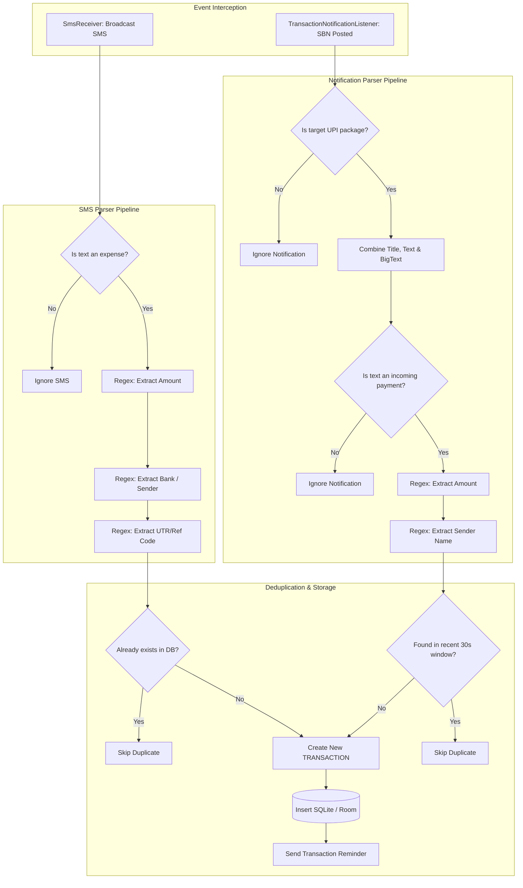

# Transaction Detection & Processing Pipeline

This document explains the technical mechanisms behind **PayStory's** dual-source transaction detection engines: the status-bar application notification scanner and the incoming network SMS interceptor.

---

## Processing Pipeline Diagram



---

## Interceptor Pipelines Detailed

### 1. The SMS Pipeline (`SmsReceiver.kt`)

The pipeline intercepts broadcasts carrying standard Telephony PDUs:

#### Step A: Filter Non-Financial Text
The SMS text payload is checked against debited keywords. If none match, the SMS is ignored:
```kotlin
val isExpense = lowercaseText.contains("debited") ||
        lowercaseText.contains("spent") ||
        lowercaseText.contains("transferred") ||
        lowercaseText.contains("successful for") ||
        lowercaseText.contains("paid") ||
        lowercaseText.contains("sent") ||
        lowercaseText.contains("withdrawn")
```

#### Step B: Extract Amount
Amounts are isolated via a case-insensitive regular expression:
* **Regex Pattern**: `(?:Rs\.?|INR|₹)\s*([0-9,]+(?:\.[0-9]{2})?)`
* **Coverage**: Recognizes standard denominations like `Rs. 250`, `Rs 500`, `Rs. 1,000`, `INR 12.50`, and `₹1,000.00`.

#### Step C: Extract Reference ID
Utr/Ref sequences are captured for duplicate checking:
* **Regex Pattern**: `(?i)(?:ref(?:erence)?\s*(?:no)?|utr|id|txn|transaction\s*id)\s*(?::|\s|-)*\s*([0-9a-zA-Z]+)`
* **Fallback Pattern**: Searches for digit blocks ranging from 8 to 12 character lengths: `\b\d{8,12}\b`.
* **Dynamic Ref Fallback**: Hash value of the text body prefixed with `"SMS-"`.

#### Step D: Identify Originating Bank
Extracts bank names from sender tags (e.g., `"AD-HDFCBK"`) or internal messages:
* **Supported Entities**: HDFC, SBI, ICICI, Axis, Kotak, PNB, BOB, Union, Canara, Yes Bank, Paytm Bank.

---

### 2. The Notification Pipeline (`TransactionNotificationListener.kt`)

Observed by extending Android's `NotificationListenerService` and targeting payment-specific app namespaces.

#### Step A: Package Whitelisting
Restricts listeners to leading UPI / Wallet packages:
* `com.phonepe.app` (PhonePe)
* `com.google.android.apps.nbu.paisa.user` (Google Pay)
* `net.one97.paytm` (Paytm)
* `in.org.npci.upiapp` (BHIM)
* `com.dreamplug.androidapp` (CRED)
* `in.amazon.mShop.android.shopping` (Amazon Pay)
* Native testing configurations (contains `"example"`, `"aistudio"`, `"paystory"`, etc.)

#### Step B: Compile Meta Text
Consolidates fields (`EXTRA_TITLE`, `EXTRA_TEXT`, `EXTRA_BIG_TEXT`, `EXTRA_SUB_TEXT`, `EXTRA_SUMMARY_TEXT`) into a continuous string before analysis.

#### Step C: Filter Inbound Receipts
Scans for incoming credits/credits:
```kotlin
val receivedKeywords = listOf(
    "received", "credited", "added", "refunded", "incoming", 
    "cashback", "deposited", "got", "paid to you", "received from"
)
```

#### Step D: Extract Sender Identity
Extracts sender identities from sequences containing phrases like `"from <name>"`, `"sent by <name>"`, or `"credited by <name>"`, stopping at boundaries like `.`, `ref`, `id`, `via`, or `at`.

---

## Anti-Collision & Deduplication Logic

To prevent double-counting of single transactions (e.g., when a user receives a bank SMS and an app status notification at the same time for the same purchase):

1. **SMS Reference Safeguard**: Checks the database for any matching transaction from source `sms` with the identical reference number:
   ```kotlin
   val isDuplicate = allTx.any { tx ->
       tx.source == "sms" && tx.referenceNumber == referenceNumber
   }
   ```
2. **Notification Time Window Safeguard**: App notifications do not contain reference IDs. Instead, they scan recent transactions (using a custom database query) within a **30-second window** (`timestamp - 30000` to `timestamp + 10000`) looking for the same amount and a matching/similar sender name:
   ```kotlin
   val recentTx = repo.findRecentTransactions(activeUserId, "notification", amount, minTime, maxTime)
   val isDuplicate = recentTx.any { tx ->
       tx.merchantName.contains(senderName, ignoreCase = true)
   }
   ```
